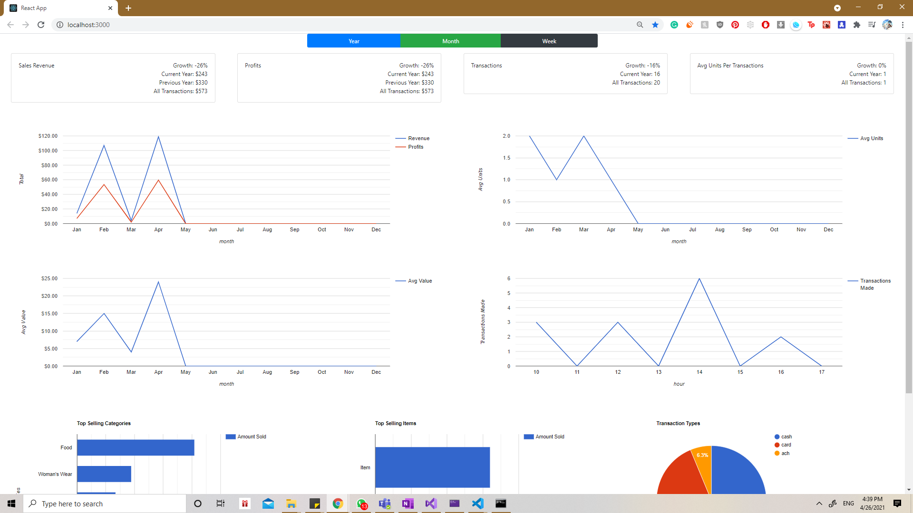
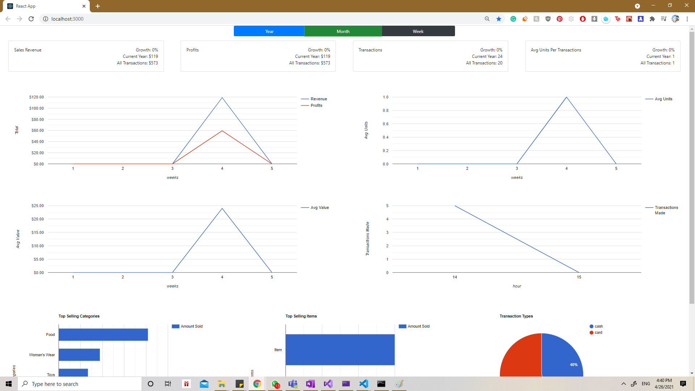
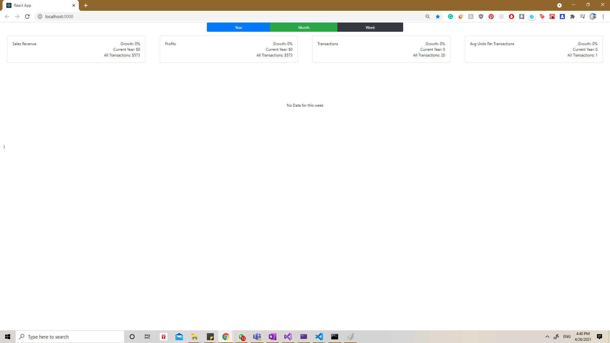
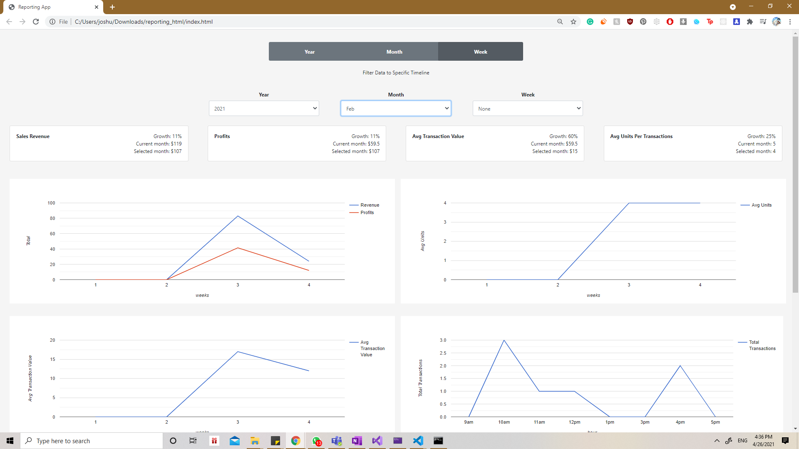
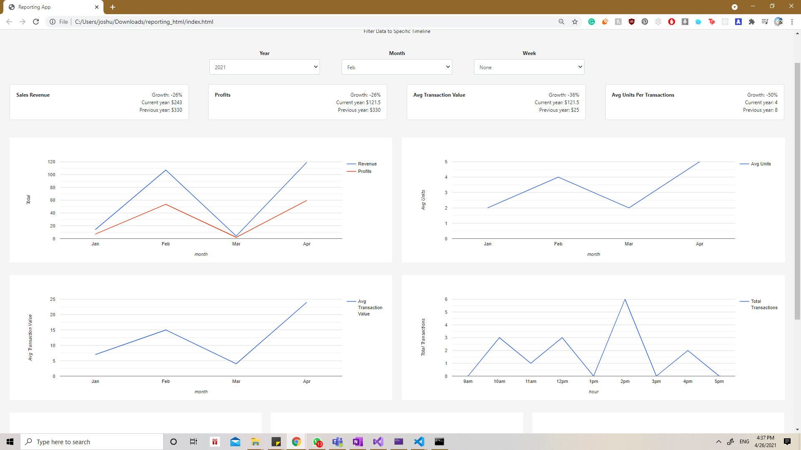
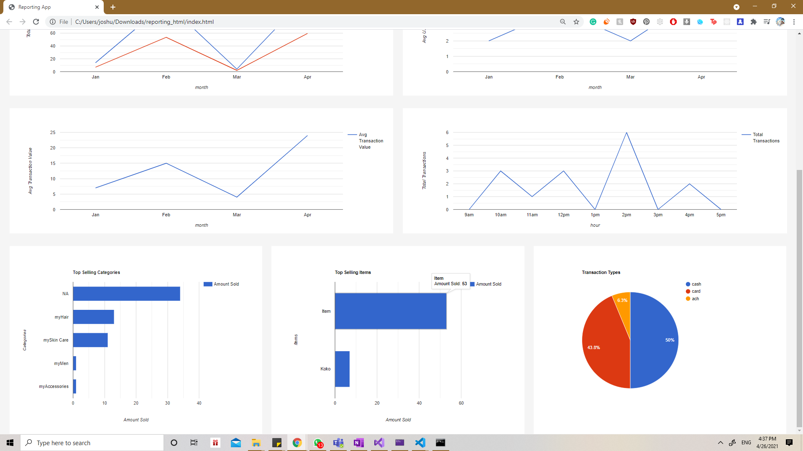
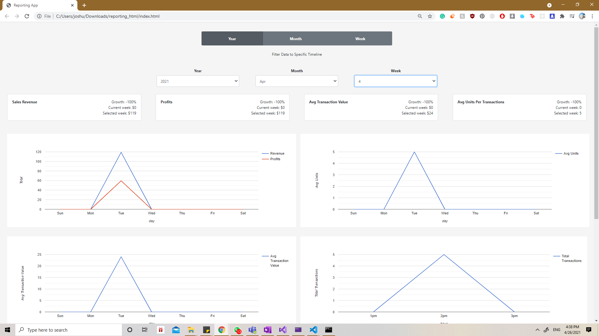

# Reporting App

The goal of the App is to take transaction data from an API and display that onto a dashboard that provides info to store managers and clerks so that they can make sense of their sales. The initial implementation was done in React, but was later converted to just plain html and javascript, with more features added

## React Images

## Complete Product Images

# Functionality

Uses have the ability to click year, month or week and gain transaction data for the current year/month/week, and see how that compares to the previous year/month/week. They also have the option to type in a custom date, and gain transaction data based on that specific date's year/month/week. In that situation the selected date's totals are compared with the current year/month/week to make comparisons easier.